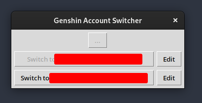

# genshin-account-switcher

Simple account switcher for Genshin Impact on Linux.

## Installation

You need to have Python 3.10+ installed.

```bash
$ pip install genshin-account-switcher
```

## CLI: Usage

### Registering an account:

```bash
$ genshin-account-switcher register
Successfully registered account '999999999'.
```

### Switching between accounts:

```bash
# No argument -> shows list of registered accounts
$ genshin-account-switcher switch  
usage: genshin-account-switcher switch [-h] [uid]

positional arguments:
  uid

options:
  -h, --help  show this help message and exit

Available UIDs:
* [0] 888888888
* [1] 999999999 ✔

# Pick one via the UID itself or the shortcut
$ genshin-account-switcher switch 888888888
Successfully switched to account '888888888'

$ genshin-account-switcher switch 1
Successfully switched to account '999999999'
```

### Naming accounts

Since UIDs are confusing you can name your account:

```bash
$ genshin-account-switcher register --name "Main Account"
Successfully registered account '888888888' under the8 name 'Main Account'.

# You'll now see the name when trying to switch:
$ genshin-account-switcher switch  
usage: genshin-account-switcher switch [-h] [uid]

positional arguments:
  uid

options:
  -h, --help  show this help message and exit

Available UIDs:
* [0] Main Account (888888888)
* [1] 999999999 ✔

# You can also use the set-name command instead of doing this while registering
$ genshin-account-switcher set-name 999999999 "Alt Account"
Successfully saved Alt Account (999999999)
```

## GUI: Usage

You can open a graphical user interface by executing the "gui" sub command:

```bash
$ genshin-account-switcher gui
```



## License

GNU General Public License v3

